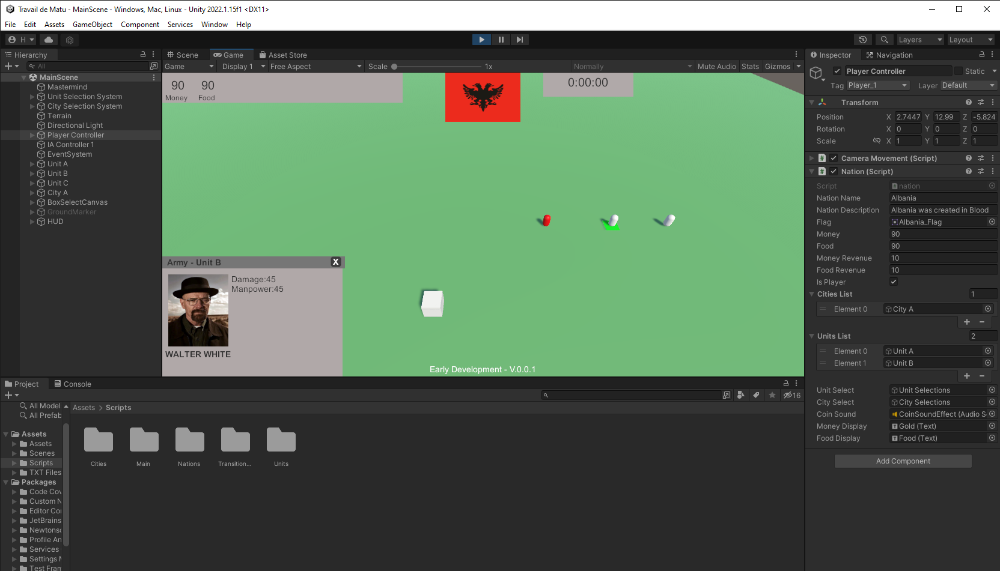

# Utopia : Glory and Beyond

    “Men come and go, cities rise and fall, whole civilizations appear and disappear - the earth remains, slightly modified.”
    - Edward Abbey, in Desert Solitaire (1968)

Utopia is a grand strategy video game that takes you from the first civilizations to the nuclear ages. Don't think that this will be a nice and cute little adventure, as your civilization will most certainly crumble to its ashes severall time and will have no certainty to get back up from them. 

History isn't a nice sitcom, where important characters can't die because it would jeopardize the series ratings and continuation, important figures, or nations, can die from stupidly insignificant factors and be forgottent forever, thus only leaving piles of rocks behind them.

The question is: will you be able to mark your place in history whilst staying alive or will you be one of these forgottent lines in the bottom corner of an old history book?

## Development

The game will be coded on the engine Unity. The mechanics will be first designed seperatly then implemented in C#, and the 3D-models will probably be created on Blender or taken on license-free websites.

")

")

## Contact

In case of interest in the project, dont hesitate to join our discord server:

    ---

Or follow our instagram account:

    ---

And, if you're a completely mad person, our reddit sub:

    ---